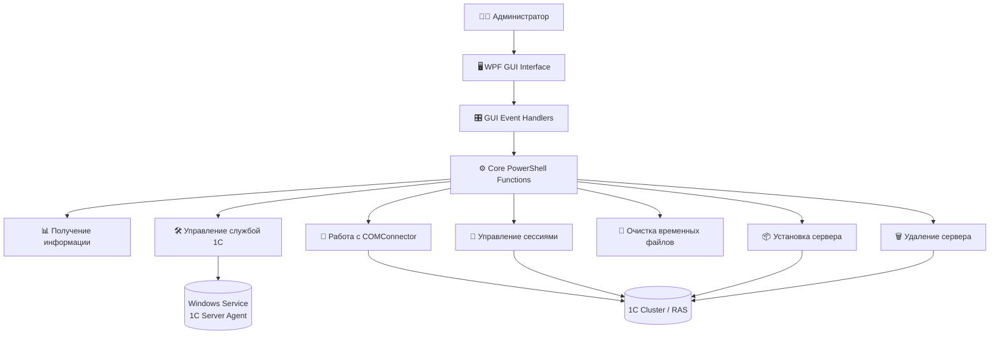

<a name="readme-top"></a>

# 1C Automation Tool — GUI Edition


[](https://creativecommons.org/licenses/by-nc/4.0/)

Инструмент автоматизации для работы с серверной средой **1С:Предприятие 8**.
Сценарий взаимодействует с сервером, каталогом **Active Directory**, контролирует пользовательский ввод и выполняет операции администрирования через **графический интерфейс PowerShell**.

---

## 📑 Оглавление

* [Лицензия и авторство](#лицензия-и-авторство)
* [Описание](#описание)
* [Требования](#требования)
* [Запуск](#запуск)
* [Функции сценария](#функции-сценария)
* [Примечания](#примечания)
* [Рекомендации](#рекомендации)

---

## ⚖️ Лицензия и авторство

Автор данного проекта: **t3hc0nnect10n**

Этот проект распространяется под лицензией **Creative Commons Attribution-NonCommercial 4.0 International (CC BY-NC 4.0)**.

Это означает, что вы можете:
*   **Делиться** — копировать и распространять материал на любом носителе и в любом формате.
*   **Адаптировать** — ремикшировать, изменять и создавать новое на основе этого материала.

**При обязательном соблюдении условий:**
*   **Attribution (Атрибуция)** — вы должны обеспечить **соответствующее указание авторства**, предоставить ссылку на лицензию и обозначить изменения, если они были сделаны.
*   **NonCommercial (Некоммерческое использование)** — вы не можете использовать этот материал в коммерческих целях.

[](https://creativecommons.org/licenses/by-nc/4.0/)

---

## 📖 Описание

### Введение
Современные серверные решения **1С: Предприятие** занимают особое место в ИТ-инфраструктуре многих предприятий. Однако, когда приходит время обновлять платформу, устанавливать или удалять сервер 1С — это требует внимательности.

В нашем случае установка сервера 1С является нетривиальной задачей. Например, необходимо установить службу 1С, указать путь для папки временных процессов, настроить определённые порты рабочих процессов, порт для сервера и кластера.

Чтобы соблюсти правильную последовательность действий — на помощь приходит **автоматизация**.

---

### ⚙️ Что умеет скрипт
Сценарий — это фактически **швейцарский нож для работы с серверной средой 1С**.

Основные функции сценария:

- Информация о COM-объекте  
- Информация о версиях платформы  
- Информация о службе  
- Работа со службой  
- Работа с COM-объектом  
- Удаление активных сессий  
- Удаление временных файлов  
- Удаление сервера  
- Установка сервера  

---

### 🖥 Как это работает
Сценарий написан на **PowerShell** с использованием GUI через **Windows Presentation Foundation (WPF)**.

Это означает, что теперь не нужно запоминать сложные командлеты или вручную запускать каждую операцию через консоль — достаточно выбрать нужное действие в удобном окне приложения.

Архитектура сценария построена **модульно**.  
Администратор выбирает задачу, вводит необходимые параметры, а скрипт автоматически выполняет нужную последовательность команд.

---

### 🚀 Преимущества и возможности кастомизации

- **Простота** — необязательно быть экспертом по PowerShell, интерфейс интуитивно понятен.  
- **Безопасность** — предусмотрена проверка входных данных для исключения ошибок.  
- **Гибкость** — сценарий легко доработать под свои задачи и добавить новые функции.  
- **Открытость** — решение с открытым кодом, любой администратор может модифицировать сценарий.

---

### 📌 Заключение
**1C Automation Tool GUI Edition** — это отличный пример того, как автоматизация способна значительно упростить жизнь администратора.

Если вы устали выполнять одни и те же рутинные операции вручную, стоит попробовать этот инструмент.

Начать очень просто:  
скачайте сценарий из репозитория, запустите его и следуйте подсказкам интерфейса.

---

## 🏗 Архитектура работы



## Требования

----------------------------------------------------------------------------------------------------------------------------------------------------------------------------------------------------------------------------------------------
|   Требование   |                                                                                 Описание                                                                                                                                  |
|----------------|---------------------------------------------------------------------------------------------------------------------------------------------------------------------------------------------------------------------------|
| **WinRM**      |          Должна быть настроена служба Windows Remote Management для удалённого выполнения.<br>[Документация Microsoft](https://learn.microsoft.com/ru-ru/windows/win32/winrm/portal)                                         |
| **PowerShell** |          Политика выполнения должна разрешать запуск скриптов.<br>[Документация Microsoft](https://learn.microsoft.com/ru-ru/powershell/module/microsoft.powershell.core/about/about_execution_policies?view=powershell-7.5) |
----------------------------------------------------------------------------------------------------------------------------------------------------------------------------------------------------------------------------------------------

---

## Политика выполнения PowerShell

Перед первым запуском может потребоваться изменить политику выполнения:

```powershell
Set-ExecutionPolicy RemoteSigned -Scope CurrentUser
```

> ⚠️ **ВАЖНО**
> Изменение политики для всей системы может потребовать **права администратора**.

---

## Запуск

```powershell
.\1C-Automation-Tool-GUI.ps1
```

После запуска:

1. Укажите имя или IP сервера
2. Нажмите **Подключиться**
3. После успешного подключения активируются функции **1–9**
4. Выберите нужную функцию и следуйте подсказкам интерфейса

---

## Функции сценария

### Таблица функций

| № | Функция                  | Назначение                                  |
| - | ------------------------ | ------------------------------------------- |
| 1 | Информация о COM-объекте | Проверка регистрации V82 / V83 COMConnector |
| 2 | Версии платформы         | Список установленных продуктов 1С           |
| 3 | Информация о службе      | Состояние служб 1С                          |
| 4 | Работа со службой        | Запуск / остановка / перезапуск             |
| 5 | Работа с COM             | Регистрация или отмена регистрации          |
| 6 | Удаление сессий          | Завершение пользовательских сессий          |
| 7 | Очистка временных файлов | Удаление временных данных 1С                |
| 8 | Удаление сервера         | Деинсталляция сервера 1С                    |
| 9 | Установка сервера        | Установка и настройка сервера               |

---

### 1. Информация о COM-объекте

Проверяет наличие компонентов:

* `V82.COMConnector`
* `V83.COMConnector`

Выводит:

* зарегистрирована ли компонента
* версию компоненты из реестра

Операция может выполняться **локально или удалённо**.

---

### 2. Информация о версиях платформы

Отображает установленные продукты:

* **1С:Предприятие**
* **1С:Enterprise**

Выводится:

* название
* версия
* издатель
* дата установки
* путь установки

Данные читаются из реестра Windows.

> ℹ️ Если продукт не найден — выводится предупреждение.

---

### 3. Информация о службе

Показывает список служб Windows, имя которых начинается с:

```
1C
```

Отображается состояние службы:

* Работает
* Остановлена

---

### 4. Работа со службой

Позволяет управлять службой 1С:

* запуск
* остановка
* перезапуск

Алгоритм:

1. выбор службы
2. выбор действия
3. выполнение операции

---

### 5. Работа с COM-объектом

Выполняет:

* регистрацию COM-компонент
* отмену регистрации

Процесс:

1. выбор службы
2. выбор действия
3. выполнение операции

---

### 6. Удаление активных сессий

Завершает пользовательские сессии в кластере 1С.

Параметры:

* компонент COMConnector
* порт сервера (например **1740**)

Режимы работы:

**Из выбранных баз**

* выбор баз из списка
* создаётся лог

**Все сессии кластера**

* отключаются все пользователи
* создаётся лог

Логи сохраняются в папке запуска сценария.

---

### 7. Удаление временных файлов

Удаляет временные файлы выбранной версии платформы.

Сценарий:

1. находит временные каталоги
2. очищает кэш
3. выводит результат операции

---

### 8. Удаление сервера

Удаляет сервер **1С:Предприятие** и связанную службу.

Процесс:

1. выбор установленного продукта
2. деинсталляция сервера
3. удаление службы

> ⚠️ **РЕКОМЕНДУЕТСЯ**
> Перед удалением убедиться, что:
>
> * отсутствуют активные сессии

---

### 9. Установка сервера

Устанавливает сервер 1С и настраивает службу.

Необходимо указать:

* путь к дистрибутиву
* MSI файл
* доменную учётную запись службы
* пароль

Настраиваемые параметры:

* порт сервера
* порт кластера
* диапазон портов рабочих процессов
* путь временных процессов

---

## Примечания

> ℹ️ Для работы с **удалённым сервером** необходимо настроить WinRM.

> ℹ️ Проверка учётных данных выполняется через **.NET System.DirectoryServices**.

> ℹ️ Пути логов и служебные параметры можно посмотреть в коде сценария.

---

## Рекомендации

> 💡 **РЕКОМЕНДАЦИЯ**
> Для удобства запуска можно собрать скрипт в **исполняемый файл (.exe)**.

Используется модуль **Win-PS2EXE**.

Установка:

```powershell
Install-Module ps2exe -Scope CurrentUser
```

Использовать параметры:

* `-noConsole`
* `-noOutput`
* `-noError`
* `-requireAdmin`

Сборка:

```powershell
Invoke-ps2exe `
-inputFile ".\1C-Automation-Tool-GUI.ps1" -outputFile ".\1C-Automation-Tool-GUI.exe" -noConsole -noOutput -noError -requireAdmin
```

<p align="right"><a href="#readme-top">🔝</a></p>
